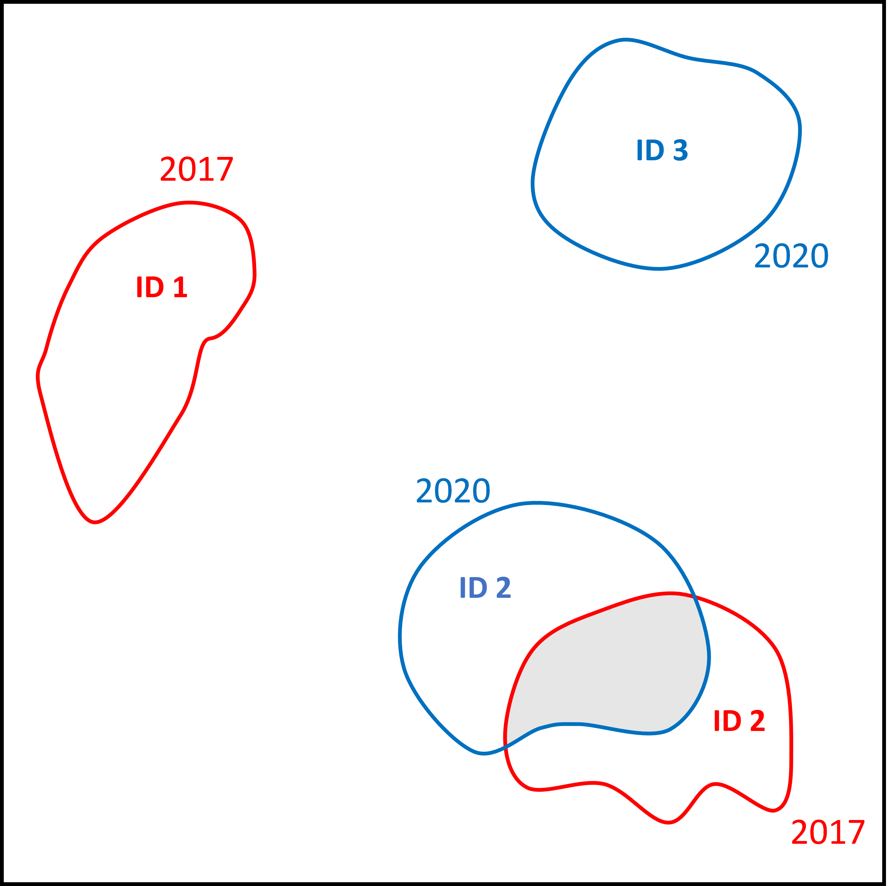
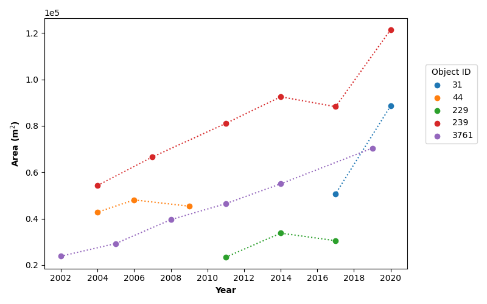

## Overview

Following the scripts and configuration files properties contained in `proj-dqry` are presented in detailed.

**TOC**
- [prepare data](#prepare-data)
- [prediction_filter](#prediction-filter)
- [detection_monitoring](#detection-monitoring)
- [plots](#plots)

## prepare data

The script `prepare_data.py` allows the user to prepare the input dataset to be processed by the `object-detector` workflow. The characteristics of the tiles are defined by the script to set the tiles' parameters for the tiling service request. _XYZ_ connector is used to fetch images with a Web Map Tiling Service _wmts_. _wmts_ allows to request of images for a given year and provides a base tile of 256 px that can be combined according to the given zoom level _z_. The zoom level will act on the tiles size (and tiles number) and the pixel resolution (z15: 3.2 m/px, z16: 1.6 m/px, z17: 0.8 m/px and z18: 0.4 m/px for _SWISSMAGE 10 cm_). _x_ and _y_ coordinates of tiles on a grid are defined for the given AOI and the zoom level. This script can be used to prepare the tiles of the **Training and evaluation** workflow and the **Prediction** workflow. It works along the config files `config-trne.yaml` and `config-prd.yaml`.

Input and output paths of the config files must be adapted if necessary. The `prepare_data.py` section of the _yaml_ configuration file is expected as follow:

    prepare_data.py:
        srs: [crs] 
        datasets:
            labels_shapefile: ../input/input-trne/[AOI_Shapefile]
      output_folder: ../output/output-prd
      zoom_level: [z]
 
The **srs** key provides the working geographical frame to ensure all the input data are compatible. Specify the **zoom_level**. Set the path to the desired label shapefile (AOI) (create a new folder /proj-dqry/input/input-prd/ to the project). 

For the quarry case, the **labels_shapefile** corresponds to the tiles intersecting labels (Ground Truth) for the **Training and evaluation** workflow: 

    [Label_Shapefile] = tlm-hr-trn-topo.shp
    
and to the tiles covering the desired AOI (_i.e._ it can be the whole of Switzerland, or part of it, such as the footprint where SWISSIMAGE has been acquired for a given year) for the 'Prediction' workflow:

    [Label_Shapefile] = swissimage_footprint_[year].shp

The script can be run by executing the following command:

    $ python3  <dir_path>/scripts/prepare_data.py <dir_path>/config/config-trne.yaml

or 

    $ python3  <dir_path>/scripts/prepare_data.py <dir_path>/config/config-prd.yaml

for 'Training and evaluation' workflow and 'Prediction' respectively.

The outputs are `tiles.geojson` files corresponding to tiles polygons obtained for the given AOI and `labels.geojson` corresponding to the input labels polygons. 

 
<i>Example of tiles obtained during the **Training and evaluation** at zoom level 16 and zoom level 17.</i>

## prediction filter

The object detection output (`oth_predictions_at_0dot*_threshold.gpkg`) obtained via the `object-detector` scripts needs to be filtered to discard false detections and improve the aesthetic of the polygons (merge polygons belonging to a single quarry). The script `prediction_filter.py` allows the extraction of the prediction out of the detection file _gpkg_ based on a series of provided threshold values. It works along with the config file `config-prd.yaml` 

First, elevation filtering is applied using a Digital Elevation Model as input. Detections above the threshold elevation are discarded (predictions at altitude 0 are also discarded because they are located outside of the DEM limits). Next, an algorithm (KMeans Unsupervised Learning) is applied to cluster polygons according to their centroids. A predefined number of clusters _k_ must be defined. It has been set to _k_ = (number of detection / 3), but the influence of this parameter can be explored by the end-user. The polygons are aggregated together according to their cluster value. The other attributes of the polygons, for instance, the prediction scores, are aggregated to the maximum value. This preserves the final integrity of detection polygons by keeping detection with potentially low scores but belonging to a cluster with higher scores. This improves the final segmentation of the detected object. Be careful to keep the threshold score value relatively low while running `make_prediction.py` to avoid removing too many polygons that could potentially be part of the object detection. Then the predictions are filtered based on the score. The detection polygons are clipped with the AOI polygon to remove odd shape polygons spreading outside. Following, polygons that are non-overlapping but are close in position are merged. Based on the polygons' area, values smaller than the threshold are discarded. Finally, an averaged predicted score is computed again taking into account the merged polygons scores. The results of the filtering/merging process are saved in a _geojson_ file.

The following images give an illustration of the extraction process showing the original and filtered predictions :

&nbsp;

 
<i>Left : Detector predictions - Right : Threshold filtering results</i>

The values of the filtering thresholds are usually obtained by analyzing the output of the prediction.

Input and output paths of the config file must be adapted if necessary. The script expects as input a detection file (`oth_predictions_at_0dot*_threshold.gpkg` obtained with `make_predictions.py` of `object-detector`) file with all geometries containing a _score_ value normalized in _[0,1]_. The `prediction_filter.py` section of the _yaml_ configuration file is expected as follow:

    prediction_filter.py:
        year:[YEAR] 
        input: ../output/output-prd/oth_predictions_at_0dot*_threshold.gpkg
        labels_shapefile: ../input/input-prd/[AOI_Shapefile] 
        dem: ../input/input-prd/[DEM_raster]  
        elevation: [THRESHOLD VALUE]   
        score: [THRESHOLD VALUE]
        distance: [THRESHOLD VALUE] 
        area: [THRESHOLD VALUE] 
        output: ../output/output-prd/oth_prediction_at_0dot*_threshold_year-[YEAR]_score-{score}_area-{area}_elevation-{elevation}_distance-{distance}.geojson

-**year**: year of the dataset used as input for filtering

-**input**: indicate the path to the input file that needs to be filtered, _i.e._ `oth_predictions_at_0dot*_threshold.gpkg`

-**labels_shapefile**: AOI of interest is used to remove polygons that are located partially outside the AOI. For the quarry project, we used the _SWISSIMAGE_ acquisition footprint for a given year. The shapefiles can be found in the STDL S3 storage (s3/proj-quarries/02_Data/Shapefiles/swissimage_footprints_shape_per_year/swissimage_footprints_border/).

-**dem**: indicate the path to a DEM of Switzerland. SRTM-derived product is used and can be found in the STDL S3 storage(s3/proj-quarries/02_Data/DEM/`switzerland_dem_EPSG:2056.tif`). A threshold elevation is used to discard detection above the given value.

-**elevation**: altitude above which predictions are discarded. Indeed 1st tests have shown numerous false detection due to snow cover area (reflectance value close to bedrock reflectance) or mountain bedrock exposure that are mainly observed at altitude. By default, the threshold elevation has been set to 1200.0 m.

-**score**: each polygon comes with a confidence score given by the prediction algorithm. Polygons with low scores can be discarded. By default, the value is set to 0.95.

-**distance**: two polygons that are close to each other can be considered to belong to the same quarry. Those polygons can be merged into a single one. By default, the buffer value is set to 10 m.

-**area**: small area polygons can be discarded assuming a quarry has a minimal area. The default value is set to 5000 m2.

-**output**: provide the path of the filtered polygons shapefile with the prediction score preserved. The output file name will be formated as: `oth_prediction_at_0dot*_threshold_year-{year}_score-{score}_elevation-{elevation}_distance-{distance}_area-{area}.geojson`.

The script can be run by executing the following command:

    $ python3 <dir_path>/scripts/prediction_filter.py <dir_path>/config/config-prd.yaml

## detection monitoring

The script `detection_monitoring.py` has been developed to identify and track an object between different year datasets. It has been developed in the scope of the quarries monitoring project and works along with the config file `config-dm.yaml`.

The script identifies the position of polygons between different years to identify a single object in several datasets. All the detection shapes are added to a single data frame. A union function is applied to merge overlapping polygons. Those polygons (single and merged) are added to a new data frame with a unique ID attributed to each. This data frame is then spatially (_sjoin_) compared to the initial data frame containing all the polygons by year. The unique ID of the polygons of the second data frame is then attributed to the intersecting polygons of the first data frame. Therefore, overlapping polygons between years are assumed to describe the same object and receive the same unique ID allowing us to track the object over years.

 
<i>Schematic representation of the object monitoring strategy.</i>

The `detection_monitoring.py` section of the _yaml_ configuration file is expected as follow:

    detection_monitoring.py:  
    years: [YEAR1, YEAR2, YEAR3,...]       
    datasets:
        detection: ../input/input-dm/oth_prediction_at_0dot*_threshold_year-{year}_score-[SCORE]_elevation-[elevation]_distance-[distance]_area-[area].geojson  
    output_folder: ../output/output-dm
  
Input and output paths of the config file must be adapted if necessary. The script takes as input a _geojson_ file. In the quarry monitoring case, ``oth_prediction_at_0dot*_threshold_year-{year}_[filters_list].geojson` files produced with the script `prediction_filter.py` of the `object-detector` for different years are used. The list of years _YEARx_ required for the object monitoring must be specified.

The script can be run by executing the following command:

    $ python3  <dir_path>/scripts/detection_monitoring.py <dir_path>/config/config-dm.yaml

The outputs are a _geojson_ and _csv_ (**quarry_time**) files saving predictions over the years with their characteristics (ID_object, ID_feature, year, score, area, geometry). 

## plots

Script to draw basic plots is provided with `plots.py` and works along with the config file `config-dm.yaml` 

The `plots.py` section of the _yaml_ configuration file is expected as follows:

    plots.py:  
    object_id: [ID_OBJECT1, ID_OBJECT2, ID_OBJECT3,...] 
    plots: ['area-year'] 
    datasets:
        detection: ../output/output-dm/quarry_times.geojson
    output_folder: ../output/output-dm/plots

Input or output paths must be adapted if necessary. The script takes as input a **quarry_times.geojson** file produced with the script `detection_monitoring.py`. The list of **object_id** _ID_OBJECTx_ must be specified and the plot type. So far only **area-year** plot is available. Additional plots can be added in the future.

The script can be run by executing the following command:

    $ python3  <dir_path>/scripts/prediction_filter.py <dir_path>/config/config-dm.yaml

Plot(s) will be produced in _png_ format

 
<i>Quarries area vs time.</i>

## 5. `batch_process.sh`

`batch_process.sh` allows the execution of a list of commands to perform the **Prediction** workflow for several years. It works along with `config.prd.template.yaml`.

The list of years to process must be specified as input of the shell script: 

    for year in YEAR1 YEAR2 YEAR3 ... 

By executing the command:

    $ ../scripts/batch_process.sh

`config-prd_[YEAR].yaml` will be generated for a given year, and the command list in `batch_process.sh` will be executed for the provided list of years:
 1. `prepare_data.py`
 2. `generate_tilesets.py` 
 3. `make_predictions.py` 
 4. `prediction_filter.py` 

The paths and value of the _yaml_ configuration file template must be adapted, if necessary.